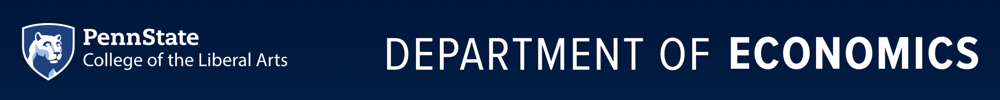

# Mini-Course on Deep Learning and Heterogeneous Agent Macroeconomics (2026)

  

This is the teaching repository for the mini-course **Deep Learning and Heterogeneous Agent Macroeconomics**, taught at the **Penn State University Department of Economics** on **September 15, 2026**.

**Instructor:** [Yucheng Yang](https://sites.google.com/site/yangyucheng1993/home) — University of Zurich and Swiss Finance Institute · <yucheng.yang@uzh.ch>

Lecture slides, code, and readings are posted here as the course approaches.

## Schedule

Both lectures take place on **Tuesday, September 15, 2026**, in **808 Ford Building**:

| Lecture | Time | Room |
|---|---|---|
| 1. Deep Learning for Solving Heterogeneous Agents Models (DeepHAM) | 3:05–4:05 PM | 808 Ford Building |
| 2. Deep Learning for Continuous Time Models and Structural Estimation (DeepSAM) | 4:15–5:15 PM | 808 Ford Building |

- **[Reading List (PDF)](Reading_List.pdf)** — suggested preparation plus core and background readings

---

## The two lectures

The course covers two deep-learning methods for solving heterogeneous agent models with aggregate shocks, in discrete and in continuous time.

| # | Lecture | Slides | Method | Core reading | Code |
|---|---------|:---:|--------|--------------|------|
| 1 | **Deep Learning for Solving Heterogeneous Agents Models** | [PDF](Lectures/Lecture1_slides_DeepHAM.pdf) | Use neural networks to parameterize high-dimensional value and policy functions in heterogeneous agent models, with the cross-sectional distribution represented by *learned generalized moments*; trained along simulated paths. | [Han, Yang & E (2026)](Readings/DeepHAM_paper.pdf), *Quantitative Economics* | [Tutorial 1: DeepHAM on Colab](Tutorials/Tutorial1) |
| 2 | **Deep Learning for Continuous Time Models and Structural Estimation** | [PDF](Lectures/Lecture2_slides_Continuous_Time_Structural_Estimation.pdf) | Search and matching with two-sided heterogeneity in continuous time: general equilibrium as a high-dimensional PDE with the distribution as a state variable, solved globally by deep learning and estimated via SMM. | [Payne, Rebei & Yang (2026)](Readings/DeepSAM_paper.pdf), *conditionally accepted, Econometrica* | [Tutorial 2: DeepSAM on Colab](Tutorials/Tutorial_DeepSAM) |

Materials: [`Lectures/`](Lectures) (slides) · [`Tutorials/`](Tutorials) (code walkthroughs) · [`Readings/`](Readings) (papers).

---

## Before the course

The lectures will be easier to follow if you have looked at the two suggested items in the [Reading List](Reading_List.pdf):

1. **Heterogeneous-agent models** — Dirk Krueger, [*An Introduction to Macroeconomics with Household Heterogeneity*](https://www.uni-bielefeld.de/fakultaeten/wirtschaftswissenschaften/einrichtungen/bigsem/profiles/economics/winter-term-2025-2026/HeteroBookLatex2025.pdf) (lecture notes), Chapter 6.
2. **Coding** — Python notebooks on solving simple Brock–Mirman models with neural networks: [deterministic](https://github.com/sischei/Deep_Learning_for_Solving_And_Estimating_Dynamic_Economic_Models/blob/main/lectures/lecture_03_deep_equilibrium_nets/code/lecture_03_01_Brock_Mirman_1972_DEQN.ipynb) and [stochastic](https://github.com/sischei/Deep_Learning_for_Solving_And_Estimating_Dynamic_Economic_Models/blob/main/lectures/lecture_03_deep_equilibrium_nets/code/lecture_03_02_Brock_Mirman_Uncertainty_DEQN.ipynb).

New to Python? See the [Python refresher](https://github.com/yangycpku/ML_Macro_Finance_Summer2026/tree/main/python_refresher).

If you plan to run the code, a [Google Colab](https://colab.research.google.com/) account is the easiest setup — the tutorial notebooks open in Colab directly and need no local installation.

---

## Related courses

A three-lecture version of this course, with an additional lecture on structural reinforcement learning, was taught at Duke University in September 2026: [Machine_Learning_Macro_Duke](https://github.com/yangycpku/Machine_Learning_Macro_Duke). A longer, five-day treatment of machine learning for macro-finance: the [PKU–Zurich PhD Summer School on Machine Learning for Macroeconomics and Finance](https://github.com/yangycpku/ML_Macro_Finance_Summer2026) (Beijing, July 2026).

---

## License

Teaching materials in this repository are released under the [Creative Commons CC0 1.0 Universal](LICENSE) license, except where individual files state otherwise (e.g. third-party code retained under its original license).
